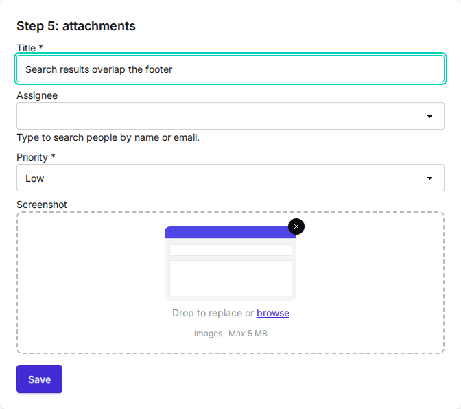
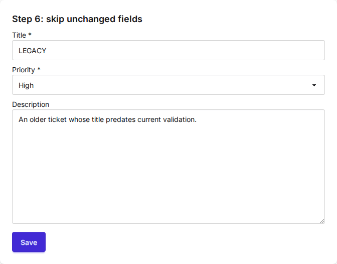

# Cookbook

This guide builds one ticket form up from a single field to a searchable,
server-validated form that saves, takes attachments, and edits existing records
without re-validating untouched fields. Each step adds one capability, and
every snippet is complete and works as shown. See the
[installation guide](getting-started/installation.md) for the one-time CSS and
JavaScript setup.

## Step 1: the form is the center

The center of Formwork is forms. You render them the normal Django way, and the
default widgets get automatic styling according to your DaisyUI theme.

```python
# forms.py
class TicketTitleForm(forms.Form):
    title = forms.CharField(max_length=200, help_text="A short summary of the ticket.")
```

```html
<!-- template.html -->

<form method="post">
  
  {{ form }}
  <button type="submit" class="btn btn-primary">Create</button>
</form>

```


`` does nothing for a plain text field yet. It loads the
JavaScript behind the richer widgets and the htmx integration that the later
steps use, so it belongs in the base template from the start.

## Step 2: richer widgets

Formwork ships widgets with extra styling and more modern behaviour, like
dropdowns with search. Here the assignee is a `SearchSelect` backed by a model,
with an initials badge and the person's email shown for each option. The
priority stays a plain `ChoiceField`; standard fields and Formwork widgets mix
freely in one form.

```python
# forms.py
from django.utils.html import format_html

from django_formwork import FormworkForm, FormworkModelChoiceField
from django_formwork.widgets import SearchSelect


def assignee_icon(person):
    initials = "".join(part[0] for part in person.name.split()[:2]).upper()
    return format_html("<span class='badge badge-neutral badge-sm'>{}</span>", initials)


class TicketWidgetsForm(FormworkForm):
    title = forms.CharField(max_length=200)
    assignee = FormworkModelChoiceField(
        queryset=Person.objects.all(),
        widget=SearchSelect(search_fields=["name", "email"], search_decorator=None),
        icon_from_instance=assignee_icon,
        description_from_instance=lambda person: person.email,
        required=False,
    )
    priority = forms.ChoiceField(choices=PRIORITY_CHOICES)
```

The dropdown searches on the server. Wire the endpoint once:

```python
# urls.py
urlpatterns = [
    path("__formwork__/", include("django_formwork.urls")),
]
```


`search_decorator` is required. Pass an auth decorator such as `login_required`
to protect the endpoint, or `None` for a public one. `icon_from_instance`
returns safe HTML; keep its attributes single-quoted so they nest inside the
widget's markup.

## Step 3: server-side validation, still MPA

Formwork makes direct server-side validation easy without leaving the typical
MPA approach. It uses htmx and morph swaps: the form posts, the server
re-renders it, and htmx morphs the whole form back in, keeping widget and focus
state.

```python
# forms.py
class TicketValidatedForm(TicketWidgetsForm):
    def clean_title(self):
        title = self.cleaned_data["title"]
        if Ticket.objects.filter(title__iexact=title).exists():
            raise forms.ValidationError("A ticket with this title already exists.")
        return title
```

```html
<!-- cookbook/_ticket_form.html -->
<form id="ticket-form" method="post"
      hx-post=""
      hx-target="#ticket-form"
      hx-swap="outerMorph"
      data-formwork-dirty>
  
  {{ form }}
  <button type="submit" class="btn btn-primary mt-4">Save</button>
</form>
```

The form tag lives in a partial that `step3.html` wraps in the full page; the
later steps reuse it, with the posting URL passed in as a variable. The view
returns just the partial for htmx requests:

```python
# views.py
def cookbook_step3(request):
    if request.method == "POST":
        form = TicketValidatedForm(request.POST)
        form.is_valid()  # render any errors; the happy path arrives in step 4
        if request.headers.get("HX-Request") == "true":
            return render(request, "cookbook/_ticket_form.html", {"form": form})
        return render(request, "cookbook/step3.html", {"form": form})
    return render(request, "cookbook/step3.html", {"form": TicketValidatedForm()})
```

`` registers the `formwork-morph` htmx extension, so the error
tooltip appears without a full page reload and in-progress input is preserved.
No `hx-ext` attribute is needed. The non-htmx branch keeps the plain form post
working when JavaScript is unavailable. `data-formwork-dirty` highlights fields
you have changed since the page loaded; it becomes useful on the edit form in
step 6.


So far the view re-renders the form whether validation passed or not. Creating
the ticket is the next step.

## Step 4: save the ticket

Tie the form to the model with `FormworkModelForm` and the view gets a regular
`form.save()` happy path. `is_valid()` now runs the model's validators as well.
The assignee field and the `clean_title` rule move over from steps 2 and 3
unchanged.

```python
# forms.py
from django_formwork import FormworkModelForm


class TicketCreateForm(FormworkModelForm):
    assignee = FormworkModelChoiceField(
        queryset=Person.objects.all(),
        widget=SearchSelect(search_fields=["name", "email"], search_decorator=None),
        icon_from_instance=assignee_icon,
        description_from_instance=lambda person: person.email,
        required=False,
    )

    class Meta:
        model = Ticket
        fields = ["title", "assignee", "priority"]

    def clean_title(self):
        title = self.cleaned_data["title"]
        if Ticket.objects.filter(title__iexact=title).exists():
            raise forms.ValidationError("A ticket with this title already exists.")
        return title
```

```python
# views.py
def cookbook_step4(request):
    if request.method == "POST":
        form = TicketCreateForm(request.POST)
        if form.is_valid():
            ticket = form.save()
            url = reverse("ck-created", args=[ticket.pk])
            if request.headers.get("HX-Request") == "true":
                return HttpResponse(headers={"HX-Redirect": url})
            return redirect(url)
        if request.headers.get("HX-Request") == "true":
            return render(request, "cookbook/_ticket_form.html", {"form": form})
        return render(request, "cookbook/step4.html", {"form": form})
    return render(request, "cookbook/step4.html", {"form": TicketCreateForm()})
```

htmx submits the form with `fetch`, so a normal redirect response would be
followed in the background and morphed into the form. The `HX-Redirect` header
tells htmx to navigate the browser instead. The non-htmx branch is the usual
post/redirect/get.


## Step 5: attachments

Tickets carry screenshots. Add an `ImageField` to the model and swap its widget
for a drop zone: drag an image in and a thumbnail preview shows before the
upload.

```python
# models.py
class Ticket(FormworkModel):
    # title, assignee, priority, description ...
    screenshot = models.ImageField(upload_to="screenshots/", blank=True)
```

```python
# forms.py
from django_formwork.widgets import ImageDropZone


class TicketUploadForm(TicketCreateForm):
    class Meta(TicketCreateForm.Meta):
        fields = [*TicketCreateForm.Meta.fields, "screenshot"]
        widgets = {"screenshot": ImageDropZone(max_size=5 * 1024 * 1024)}
```

Uploads change two things outside the form class. The form tag gains the
multipart attributes, and the view passes `request.FILES`:

```html
<form id="ticket-form" method="post"
      enctype="multipart/form-data"
      hx-encoding="multipart/form-data"
      hx-post=""
      hx-target="#ticket-form"
      hx-swap="outerMorph"
      data-formwork-dirty>
```

```python
# views.py
form = TicketUploadForm(request.POST, request.FILES)
```



htmx does not read the form's `enctype`. Without
`hx-encoding="multipart/form-data"` it submits the fields urlencoded and the
file never reaches the server; `enctype` still covers the no-JavaScript
fallback, so keep both. `max_size` rejects oversized files in the browser only, server-side
checks stay your job. `upload_to` needs the usual `MEDIA_ROOT` and `MEDIA_URL`
settings.

## Step 6: skip validation for unchanged fields

The steps so far create tickets. Editing an existing one runs into a different
problem: re-running validation on fields the user did not touch can reject
legacy data that is fine to leave alone. The example app seeds a ticket whose
title today's validator would reject:

```python
# models.py
def reject_legacy_title(value):
    if value == "LEGACY":
        raise ValidationError("Legacy titles are no longer allowed.")


class Ticket(FormworkModel):
    title = models.CharField(max_length=200, validators=[reject_legacy_title])
    # assignee, priority, description, screenshot ...
```

Set `validate_dirty_only` on a `FormworkModelForm` whose model inherits
`FormworkModel`; the model base brings the dirty-field tracking the form needs.
The field list trims to what this page edits; `description` has been on the
model all along.

```python
# forms.py
class TicketEditForm(FormworkModelForm):
    class Meta:
        model = Ticket
        fields = ["title", "priority", "description"]
        validate_dirty_only = True
```

The view binds the form to the existing instance and saves as usual:

```python
# views.py
def cookbook_step6(request):
    ticket = Ticket.objects.order_by("pk").first()
    if request.method == "POST":
        form = TicketEditForm(request.POST, instance=ticket)
        if form.is_valid():
            form.save()
        if request.headers.get("HX-Request") == "true":
            return render(request, "cookbook/_ticket_form.html", {"form": form})
        return render(request, "cookbook/step6.html", {"form": form})
    return render(request, "cookbook/step6.html", {"form": TicketEditForm(instance=ticket)})
```

Editing only the description of the LEGACY ticket now validates and saves.
Unchanged fields skip their field validators, `clean_<field>` methods,
model-level validation, and unique and constraint checks; their stored values
carry through untouched. On create, the model's `full_clean()` covers every
field as usual. See the [forms reference](reference/forms.md#validate_dirty_only)
for the exact rules.

This is the form `data-formwork-dirty` from step 3 was added for: it highlights
the fields you changed, which here is exactly the set the server will validate.
The two mechanisms are independent. The highlight is client-side display; the
decision to skip is made on the server by comparing the posted data against the
loaded instance, and it works the same without the attribute.



## Going further

- Validation can run async. The form base classes accept async `clean_<field>`
  and `clean` methods; async views call `await form.ais_valid()` and
  `await form.asave()`. See
  [async validation](reference/forms.md#async-validation-and-saving).
- Search does not need a model. A `search_choices_<field>(query, request)`
  method on the form serves any `SearchSelect`, `MultiSelect`, or `ComboBox`.
  See [server-side search](getting-started/quickstart.md#server-side-search).
- The [full example](https://github.com/oliverhaas/django-formwork/tree/main/examples/full)
  is a small task manager that combines these patterns with `MultiSelect`,
  `DatePicker`, and a multi-step wizard.

The [Forms](reference/forms.md), [Widgets](reference/widgets.md), and
[Views](reference/views.md) references document the details.
