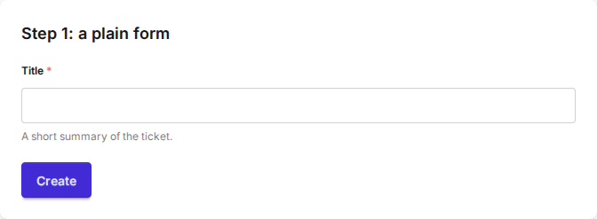
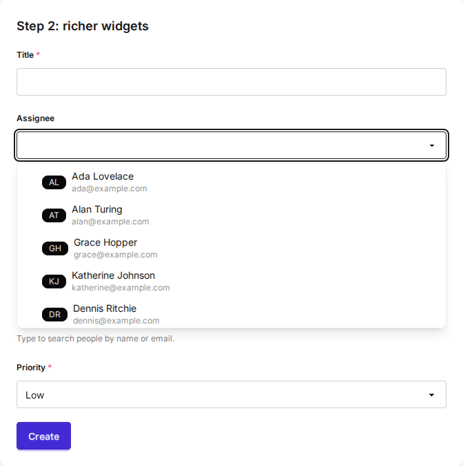
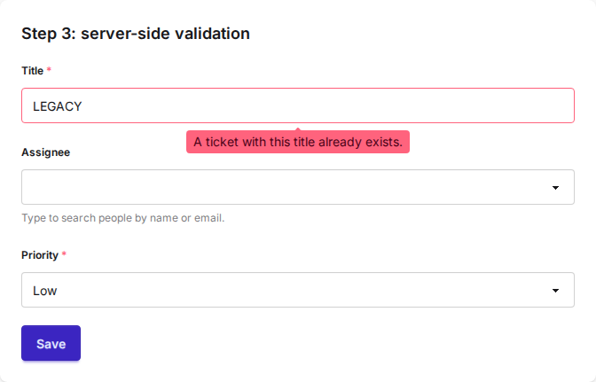
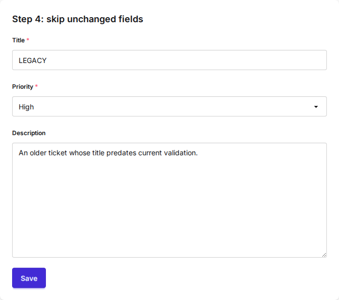

# Cookbook

This guide builds one ticket form up from a single field to a searchable,
server-validated, dirty-aware form. Each step adds one capability. The forms and
views are from the runnable `examples/simple` app, so every snippet works as
shown. See the [installation guide](getting-started/installation.md) for the
one-time CSS and JavaScript setup.

## Step 1: the form is the center

The center of Formwork is forms. You render them the normal Django way, and the
default widgets get automatic styling.

```python
# forms.py
class TicketTitleForm(forms.Form):
    title = forms.CharField(max_length=200, help_text="A short summary of the ticket.")
```

```html
<!-- template.html -->

<form method="post">
  
  {{ form }}
  <button type="submit" class="btn btn-primary">Create</button>
</form>

```



## Step 2: richer widgets

Formwork ships widgets with extra styling and more modern behaviour, like
dropdowns with search. Here the assignee is a `SearchSelect` backed by a model,
with an initials badge and the person's email shown for each option.

```python
# forms.py
from django.utils.html import format_html

from django_formwork.fields import FormworkModelChoiceField
from django_formwork.forms import FormworkForm
from django_formwork.widgets import SearchSelect


def assignee_icon(person):
    initials = "".join(part[0] for part in person.name.split()[:2]).upper()
    return format_html("<span class='badge badge-neutral badge-sm'>{}</span>", initials)


class TicketWidgetsForm(FormworkForm):
    title = forms.CharField(max_length=200)
    assignee = FormworkModelChoiceField(
        queryset=Person.objects.all(),
        widget=SearchSelect(search_fields=["name", "email"], search_decorator=None),
        icon_from_instance=assignee_icon,
        description_from_instance=lambda person: person.email,
        required=False,
    )
    priority = forms.ChoiceField(choices=PRIORITY_CHOICES)
```

The dropdown searches on the server. Wire the endpoint once:

```python
# urls.py
urlpatterns = [
    path("__formwork__/", include("django_formwork.urls")),
]
```



`search_decorator` is required. Pass an auth decorator such as `login_required`
to protect the endpoint, or `None` for a public one. `icon_from_instance`
returns safe HTML; keep its attributes single-quoted so they nest inside the
widget's markup.

## Step 3: server-side validation, still MPA

Formwork makes direct server-side validation easy without leaving the typical
MPA approach. It uses htmx and morph swaps: the form posts, the server
re-renders it, and htmx morphs the whole form back in, keeping widget and focus
state.

```python
# forms.py
class TicketValidatedForm(TicketWidgetsForm):
    def clean_title(self):
        title = self.cleaned_data["title"]
        if Ticket.objects.filter(title__iexact=title).exists():
            raise forms.ValidationError("A ticket with this title already exists.")
        return title
```

```html
<!-- the form posts to itself and morph-swaps the result -->
<form id="ticket-form" method="post"
      hx-post=""
      hx-target="#ticket-form"
      hx-swap="outerMorph"
      data-formwork-dirty>
  
  {{ form }}
  <button type="submit" class="btn btn-primary mt-4">Save</button>
</form>
```

```python
# views.py
def cookbook_step3(request):
    if request.method == "POST":
        form = TicketValidatedForm(request.POST)
        form.is_valid()
        if request.headers.get("HX-Request") == "true":
            return render(request, "cookbook/_ticket_form.html", {"form": form})
        return render(request, "cookbook/step3.html", {"form": form})
    return render(request, "cookbook/step3.html", {"form": TicketValidatedForm()})
```

`` registers the `formwork-morph` htmx extension, so the error
tooltip appears without a full page reload and in-progress input is preserved.
No `hx-ext` attribute is needed.



## Step 4: skip validation for unchanged fields

When editing an existing record, re-running validation on fields the user did
not touch can reject legacy data that is fine to leave alone. Set
`validate_dirty_only` on a `FormworkModelForm` whose model inherits
`FormworkModel`.

```python
# models.py
from django_formwork.models import FormworkModel


class Ticket(FormworkModel):
    title = models.CharField(max_length=200, validators=[reject_legacy_title])
    # assignee, priority, description ...
```

```python
# forms.py
class TicketEditForm(FormworkModelForm):
    class Meta:
        model = Ticket
        fields = ["title", "priority", "description"]
        validate_dirty_only = True
```

Editing only the description of a ticket whose title is `"LEGACY"` now
validates, because the unchanged title is skipped. On create, every field is
validated as usual.



## Going further

- Async validation in async views: `await form.ais_valid()` and `await form.asave()`.
- Choices-backed search without a model: a `search_choices_<field>(query, request)` method on the form.
- File and image drop zones with size limits.

See the [Widgets](reference/widgets.md) and [Views](reference/views.md) reference.
